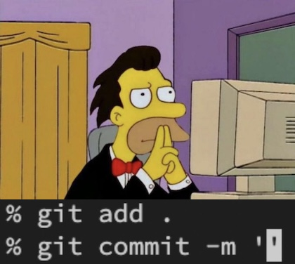
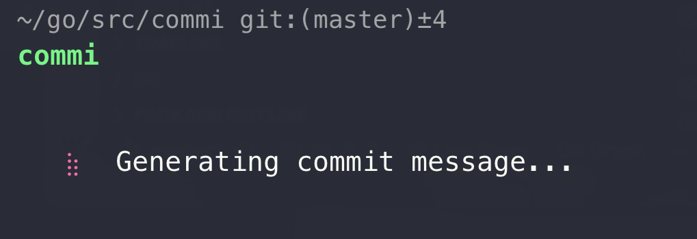
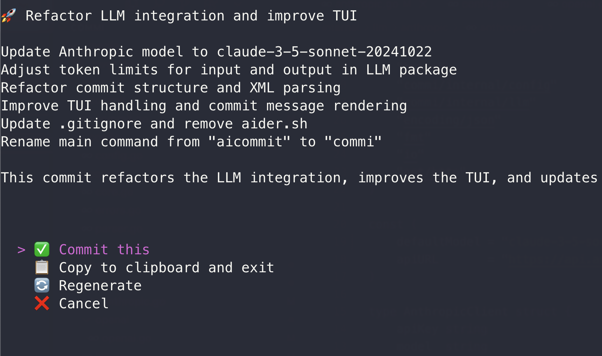

# COMMI

COMMI is your git commit friend.

## Installation

### Using the Installation Script (Recommended)

The easiest way to install COMMI is by using the provided installation script:

```bash
git clone https://github.com/user/commi.git
cd commi

./install.sh
```


### Manual Installation from Source

Alternatively, you can manually build and install:

```bash
git clone https://github.com/user/commi.git
cd commi

go build
go install
```

## Usage

cd to a project with git that has some changes you want to commit and run 

```bash
commi
```

Or if you want to commit in YOLO mode without review:

```bash
commi -f
```

Or if you want to specify a subject for the commit message (like a jira ticket?):

```bash
commi "CR-22 WIP"
```





### Optional Arguments

- `[subject]`: Specify a subject for the commit message (optional).
- `-f, --force`: Commit generated message without review (yolo mode).
- `-v, --version`: Display version information.

## Configuration

For Anthropic:
```bash
export ANTHROPIC_API_KEY=your_api_key_here
```

For OpenAI:
```bash
export OPENAI_API_KEY=your_api_key_here
```

## Environment Variables

- `ANTHROPIC_API_KEY`: Your Anthropic API key
- `OPENAI_API_KEY`: Your OpenAI API key

## License

Code is released under the MIT License.

## Special thanks to
Sonnet 3.5